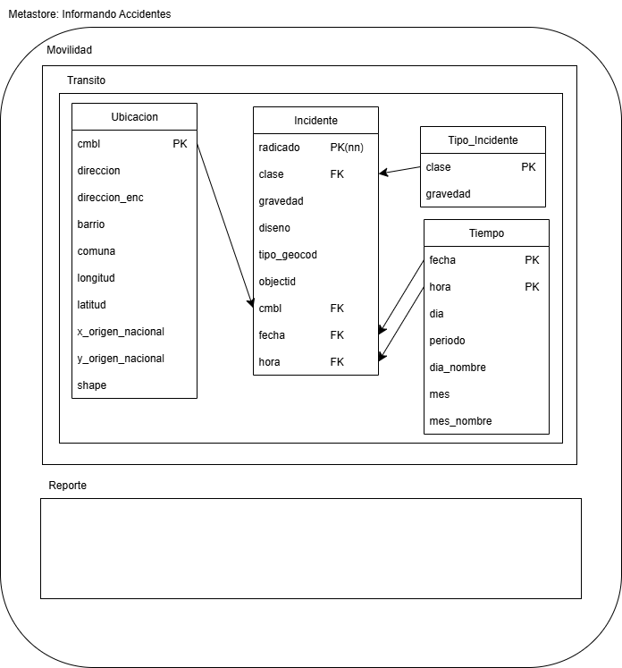

# 📌 Actividad 2 

**Autores:** Katerin Vanesa Lopez Moros  
Bayron Meza Guzman  
Grupo 15  
**Docente:** Andres Felipe Callejas  
**Materia:** Big Data Grupo 61

## 🚀**Descripción:**
En esta actividad se desarrolla una serie de puntos que tienen como objetivo principal recolectar un conjunto de datos y así desplegarlo sobre una infraestructura virtual, que en este caso en especial será Datadricks Community Edition, diseñando el esquema de almacenamiento, configurando la arquitectura básica, cargando datos desde un dataset y validando todo el procesamiento con Spark y SQL.

## 1️⃣ **Esquema** 
Las entidad clave de este dataset son:
Ubicación, Tiempo, Tipo de incidente e Indicente  
Los campos claves son:  
Llave primaria (PK) encontramos radicado que es el indicador unico del reporte de incidente  
Los tipos de datos predominan las cadenas de texto (String) para las categorias y fechas hay datos númericos (double) para las coordenadas (integer) para las dimensiones de tiempo.  
Y la nulabilidad a campos como mes_nombre  
  
**Diccionario de datos**  
| Campo | Tipo de dato | Descripción | ¿Puede ser null? |
|-----------|-----------|-----------|-----------|
OBJECTID|Integer|Identificador único del registro (ID técnico)|No
Shape|String|Representación geométrica|No
radicado|Long|Número de radicado del expediente (ID Negocio)|No
fecha|Date/Timestamp|Fecha del accidente|No
hora|String|Hora del evento (formato 12h AM/PM)|Sí
dia|Integer|Día del mes|No
periodo|Integer|Año del evento|No
clase|String|"Tipo de accidente"|Sí
direccion|String|Dirección normalizada|Sí
direccion_enc|String|Dirección codificada para geolocalización|Sí
cbml|String|Código de manzana/localización|Sí
tipo_geocod|String|Método usado para geocodificar|Sí
gravedad|String|Severidad del incidente|No
barrio|String|Nombre del barrio|Sí
comuna|String|Nombre de la comuna o zona|Sí
diseno|String|"Diseño de la vía (Tramo, Intersección)."|Sí
dia_nombre|String|Día de la semana|No
mes|Integer|Número del mes|No
mes_nombre|String|Nombre del mes|Sí
longitud|Double|Coordenada geográfica X|Sí
latitud|Double|Coordenada geográfica Y|Sí

## 2️⃣ **Configuración de Databricks**
Debes mostrar paso a paso (con capturas y/o salidas de celdas) la configuración del entorno:

Versión de Databricks Runtime, tipo de clúster, núcleos/RAM, autoscaling.

Versiones de Python/Spark: spark.version, spark.sparkContext.getConf().getAll().

Estructura de almacenamiento (DBFS o Volumes) que utilizarás.

Sugerencia: usa celdas Python para imprimir la configuración y celdas %md para documentar.

## 3️⃣ **Ingesta desde Kaglee + creación de tabla**
Obtención del dataset:

Opción A (API Kaggle): instala kaggle, configura el token y descarga al workspace/DBFS.

Opción B (Manual/URL): descarga local y carga el archivo a DBFS (UI: Upload a /FileStore o Volumes).

Carga en Spark: lee el archivo (CSV/JSON/Parquet) con spark.read aplicando el esquema diseñado.

Persistencia: crea una tabla (saveAsTable o CREATE TABLE USING) y muestra %sql DESCRIBE TABLE.

Incluye capturas/salidas de lectura, recuentos y confirmación de la ruta/tabla creada.

## 4️⃣ **Validaciones**
Realiza validaciones en Spark (PySpark) y en SQL con salidas visibles:

Metadatos: %sql DESCRIBE TABLE, SHOW CREATE TABLE; en Spark: df.printSchema().

Descripción de datos: df.describe().show() y/o %sql con funciones agregadas.

Consultas SELECT y GROUP BY: equivalentes en Spark y SQL comparando resultados.

Conteos y muestras: COUNT(*), LIMIT, filtros por campo.

Explica brevemente cada resultado y su propósito de validación.

## 5️⃣ **Ventajas y Desventajas entre Spark y SQL**
