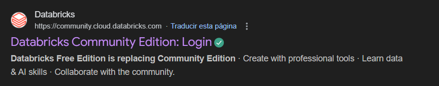
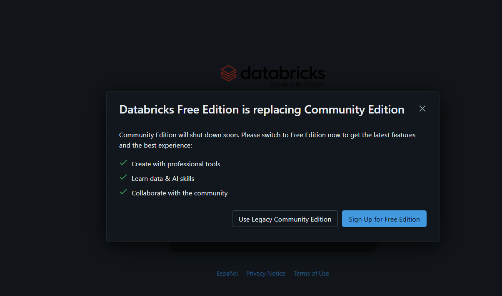
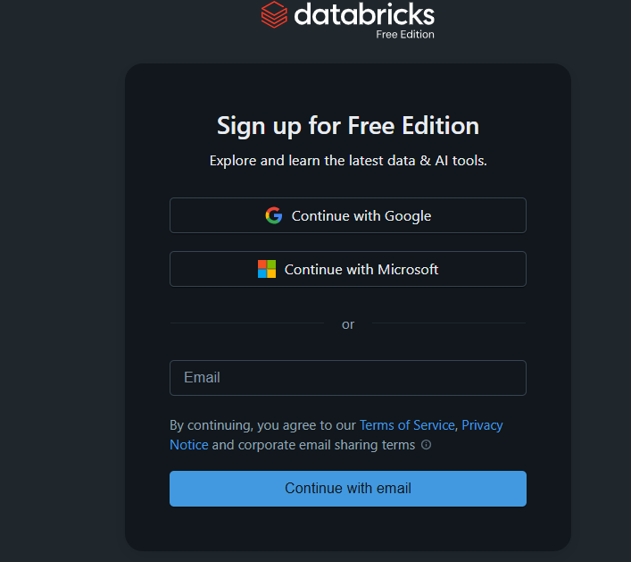
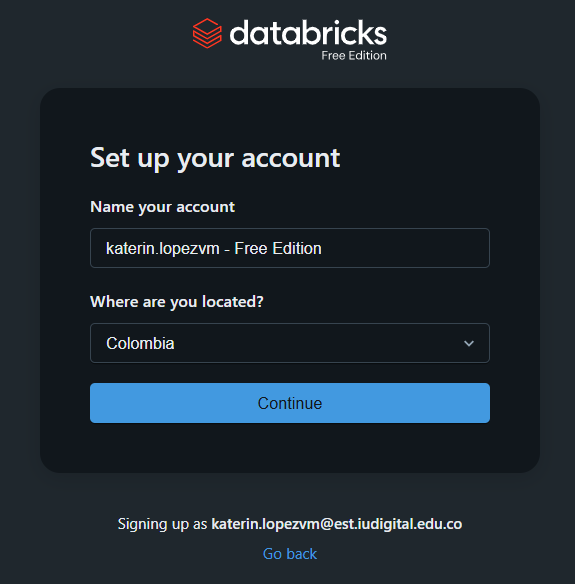
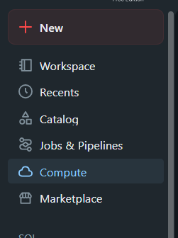
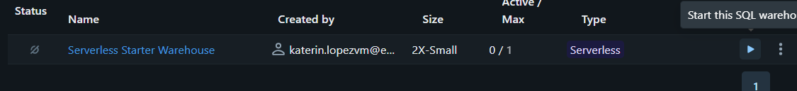
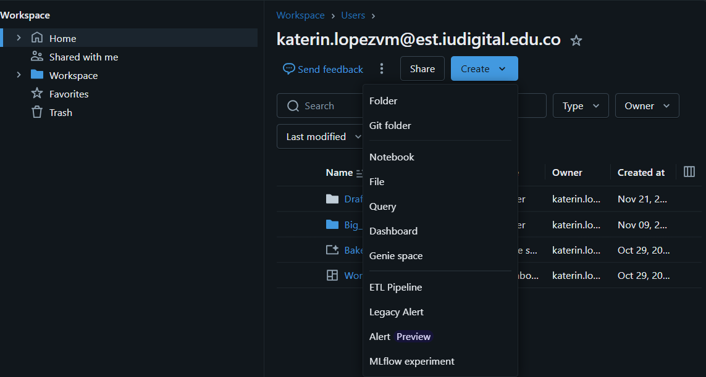
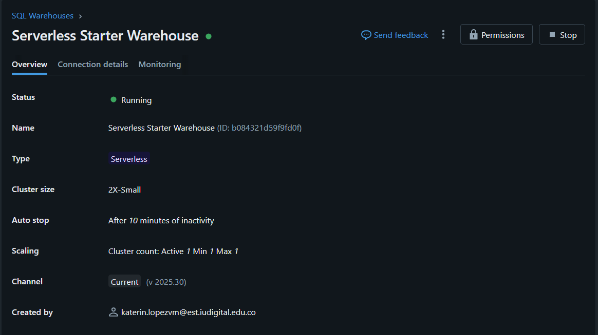

# 📌 Actividad 2 

**Autores:** Katerin Vanesa Lopez Moros  
Bayron Meza Guzman  
Grupo 15  
**Docente:** Andres Felipe Callejas  
**Materia:** Big Data Grupo 61

## 🚀**Descripción:**
En esta actividad se desarrolla una serie de puntos que tienen como objetivo principal recolectar un conjunto de datos y así desplegarlo sobre una infraestructura virtual, que en este caso en especial será Datadricks Community Edition, diseñando el esquema de almacenamiento, configurando la arquitectura básica, cargando datos desde un dataset y validando todo el procesamiento con Spark y SQL.

## ✏️ **Esquema** 
Las entidades clave de este dataset son:
Ubicación, Tiempo, Tipo de incidente e Indicente  
Los campos claves son:  
Llave primaria (PK) encontramos radicado que es el indicador unico del reporte de incidente  
Los tipos de datos predominan las cadenas de texto (String) para las categorias y fechas hay datos númericos (double) para las coordenadas (integer) para las dimensiones de tiempo.  
Y la nulabilidad a campos como mes_nombre  
  
**📖Diccionario de datos**  
| Campo | Tipo de dato | Descripción | ¿Puede ser null? |
|-----------|-----------|-----------|-----------|
OBJECTID|Integer|Identificador único del registro (ID técnico)|No
Shape|String|Representación geométrica|No
radicado|Long|Número de radicado del expediente (ID Negocio)|No
fecha|Date/Timestamp|Fecha del accidente|No
hora|String|Hora del evento (formato 12h AM/PM)|Sí
dia|Integer|Día del mes|No
periodo|Integer|Año del evento|No
clase|String|"Tipo de accidente"|Sí
direccion|String|Dirección normalizada|Sí
direccion_enc|String|Dirección codificada para geolocalización|Sí
cbml|String|Código de manzana/localización|Sí
tipo_geocod|String|Método usado para geocodificar|Sí
gravedad|String|Severidad del incidente|No
barrio|String|Nombre del barrio|Sí
comuna|String|Nombre de la comuna o zona|Sí
diseno|String|"Diseño de la vía (Tramo, Intersección)."|Sí
dia_nombre|String|Día de la semana|No
mes|Integer|Número del mes|No
mes_nombre|String|Nombre del mes|Sí
longitud|Double|Coordenada geográfica X|Sí
latitud|Double|Coordenada geográfica Y|Sí

➡️ El DDL se encuentra dentro del ipynb

## 🔧 **Configuración de Databricks**
Los pasos que deber seguir para configurar Databricks Community Edition, Free version son:  

**1️⃣Paso 1:** Buscamos en el navegador Databricks  Community Edition y abrimos la primera opción.
  
**2️⃣Paso 2:** Estando dentro damos click en "Sign Up Free Edition".  
  
**3️⃣Paso 3:** Continuamos con nuestra cuenta de Google o si lo preferimos con una cuenta de Microsoft.  
  
**4️⃣Paso 4:** Nos aparecerá de la siguiente manera con nuestro email más "- Free edition" y continuamos.  
  
**5️⃣Paso 5:** Nos aparecerá un par de pasos de verificación para continuar y proteger nuestra cuenta, continuamos con ellos.
  
**6️⃣Paso 6:** Luego de eso nos verificará y nos dará acceso a nuestra nueva cuenta en Databricks.  
**7️⃣Paso 7:** Ya para este punto echaremos un vistazo a la cuenta, nos dirigimmos a la barra lateral izquiera en la opción "Compute".  
  
Y podemos ver que ya por defecto nos provee un servidor listo solo para levantar (Se hace en el boton de play) y empezar a trabajar.  
  
Ya desplegado el servidor de Big Data podemos crear carpetas, notebooks, querys, y más.  
Esto llendo a la barra lateral izquierda en workspace, Create.  
  

**Mostramos la configuración de la cuenta**  
  

**📦 Estructura de almacenamiento**  
Se utilizará **DBFS** para cargar archivos CSV temporales durante el desarrollo.  
Los datos finales se almacenarán en **Volumes** dentro del catálogo `catalog_movilidad`, esquema `schema_transito`, volumen `big_data`.  
Ruta: `/Volumes/workspace/big_data/actividad2/dataset.csv`  
➡️ Versiones de Python/Spark dentro del ipynb

## 🔗 **Ingesta desde Kaglee + creación de tabla**
Obtención del dataset:  
En este caso se hizo por la opción B (manual), por medio de la descarga local y carga al archivo a DBFS como lo dice en el punto anterior.  
➡️ De aquí en adelante tanto como la lectura del archivo, la creación de la tabla y el describe se encuentran en el ipynb.  

## ⚠️ **Validaciones**
➡️ Todas las validaciones se encuentran dentro del ipynb

## 🔝 **Ventajas y Desventajas entre Spark y SQL**
|  | SPARK | SQL |
|-----------|-----------|-----------|
| **Ventajas** | 1. Para los bucles, condicionales, manejo de errores es mejor.  2. Tiene la capacidad de implementar una libreria nativa para modelos de Machine Learning.  3. Son muchos más faciles la depuración, pudiendo implementar pruebas unitarias. | 1. Es de fácil uso.  2. Le puedes decir al motor que datos quieres ver y como los quieres ver en consola.  3. Tienes tareas de resumen como sumar, agrupar, contar. |
| **Desventajas** | 1. Debe traducir constantemente los datos, (serializar y deserializar) lo que hace que se sobrecarge.  2. Para las tareas de agregación tiene un codigo mucho más largo y complejo que SQL.  3. Las librerias, si el código depende de librerias se deben instalar en todos los nodos del cluster. | 1. Los bucles con variables complejas se vuelve poco lejible.  2. Para los esquemas suele requerir que la estructura de la tabla esté definida antes de cargar datos.  3. Es dificil poner punto de interrupción en medio de una consulta grande. |

Por lo que podemos concluir que ambas tienen lados fuertes y lados en los que es más compplejo su uso, más en lo particular para este tipo de trabajo preferimos SQL.
